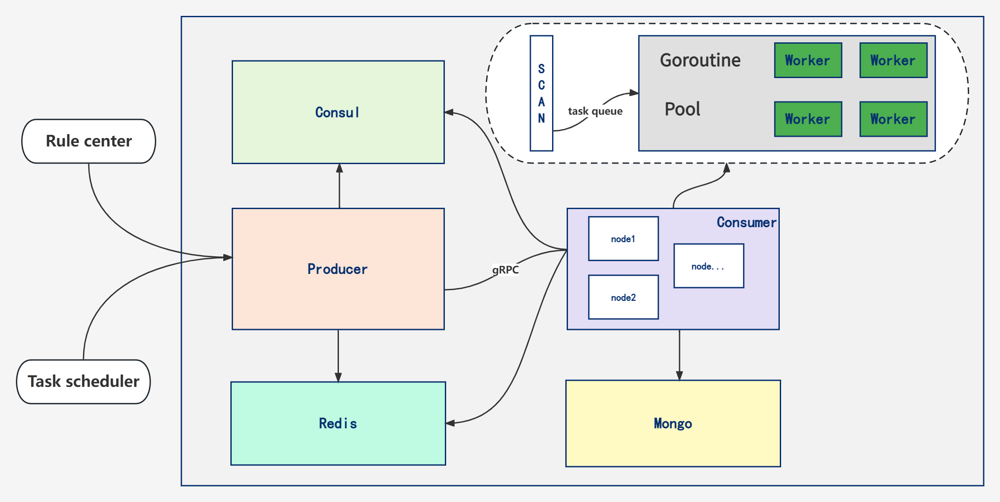

[](https://github.com/xxddpac/dss/actions/workflows/ci.yml)


<a href="https://goreportcard.com/report/github.com/xxddpac/dss"></a>


# An Distributed Security Scan Framework written in Go

### Requirements

- [Golang](https://go.dev/doc/install)
- [MongoDB](https://docs.mongodb.com/manual/installation/)
- [Redis](https://redis.io/docs/getting-started/installation/)
- [GRPC](https://grpc.io/docs/languages/go/quickstart/)
- [Consul](https://developer.hashicorp.com/consul/docs)

### How to

on producer node

```bash
go run main.go producer -c conf.dev.toml
```

on multiple consumer nodes

```bash
go run main.go consumer -c conf.dev.toml
```

open api docs

```bash
http://producer_ip:9091/swagger/index.html
```

init api docs

```bash
swag init -o core/swagger
```

### Project structure

```bash
├── common
│   ├── async # init goroutine pool
│   │   ├── worker.go
│   │   └── workerpool.go
│   ├── cert # gRPC certificate
│   │   ├── ca.key
│   │   ├── ca.pem
│   │   ├── ca.srl
│   │   ├── client.csr
│   │   ├── client.key
│   │   ├── client.pem
│   │   ├── openssl.cnf
│   │   ├── server.csr
│   │   ├── server.key
│   │   └── server.pem
│   ├── consul # consul register service
│   │   ├── consul.go
│   │   └── consul_test.go
│   ├── http
│   │   ├── http.go
│   │   └── http_test.go
│   ├── log
│   │   ├── log.go
│   │   └── log_test.go
│   ├── mongo
│   │   ├── config.go
│   │   └── mongo.go
│   ├── redis
│   │   ├── config.go
│   │   └── redis.go
│   ├── utils # public tools
│   │   ├── utils.go
│   │   ├── utils_test.go
│   │   ├── xlsx.go
│   │   └── xlsx_test.go
│   └── wp # weak password list
│       ├── list
│       ├── parser.go
│       └── parser_test.go
├── conf.dev.toml  # development configuration
├── conf.prod.toml # production configuration
├── core
│   ├── cmd # cli run 
│   │   ├── consumer.go
│   │   └── producer.go
│   ├── config # init conf.*.toml
│   │   └── conf.go
│   ├── dao
│   │   ├── mongo.go
│   │   ├── mongo_test.go
│   │   ├── redis.go
│   │   ├── redis_test.go
│   │   └── repo.go
│   ├── discover # consul discover service
│   │   └── discover.go
│   ├── errors
│   │   ├── business_error.go
│   │   └── errors.go
│   ├── global
│   │   ├── enum.go
│   │   └── global.go
│   ├── grpc # gRPC server and client
│   │   ├── consumer
│   │   │   └── client.go
│   │   ├── producer
│   │   │   └── server.go
│   │   └── proto
│   │       ├── stream.pb.go
│   │       └── stream.proto
│   ├── host # get nodes info 
│   │   ├── host.go
│   │   └── host_test.go
│   ├── management
│   │   ├── grpc.go
│   │   ├── rule.go
│   │   ├── scan.go
│   │   └── task.go
│   ├── models
│   │   ├── grpc.go
│   │   ├── models.go
│   │   ├── response.go
│   │   ├── rule.go
│   │   └── scan.go
│   ├── router
│   │   ├── router.go
│   │   └── v1
│   │       ├── api.go
│   │       ├── grpc.go
│   │       ├── rule.go
│   │       ├── scan.go
│   │       └── task.go
│   ├── scan # define scan tasks here
│   │   ├── dispatch.go
│   │   ├── mysql.go
│   │   ├── redis.go
│   │   ├── scan.go
│   │   └── ssh.go
│   ├── server # restful web and graceful shutdown service
│   │   └── server.go
│   └── swagger # api docs
│       ├── docs.go
│       ├── swagger.json
│       └── swagger.yaml
├── doc
│   └── scan.jpg
├── go.mod
├── go.sum
├── LICENSE
├── main.go
└── README.md
```

## Architecture



## Contributing

Contributors are welcome, please fork and send pull requests! If you find a bug
or have any ideas on how to improve this project please submit an issue.

